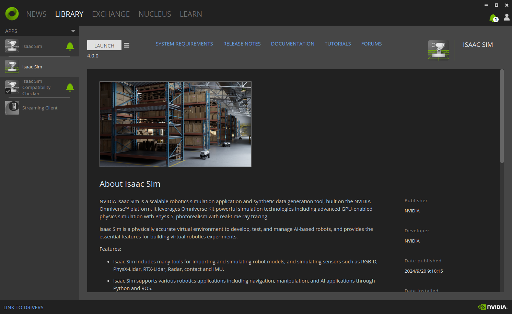
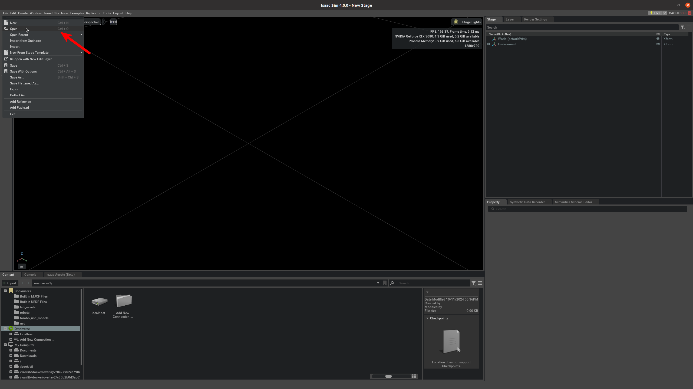
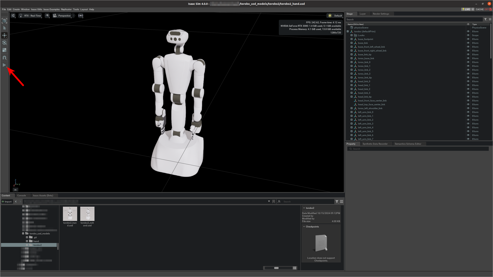

# torobo_usd_models
USD models for NVIDIA Isaac Sim

## Insall Isaac Sim
1. Create NVIDIA accout.

    Please refer to https://account.nvidia.com/ .

2. Install Omniverse Launcher and Isaac Sim.

    Please refer to https://docs.omniverse.nvidia.com/isaacsim/latest/installation/install_workstation.html#workstation-setup .


## Example
1. Clone this repository.
    ```
    git clone https://github.com/TokyoRobotics/torobo_usd_models.git
    ```

2. Open Isaac Sim from Omniverse Launcher.

    

3. Open torobo_usd_models and select torobo2_hand.usd.

    

4. Click the arrow to start simulation.

    